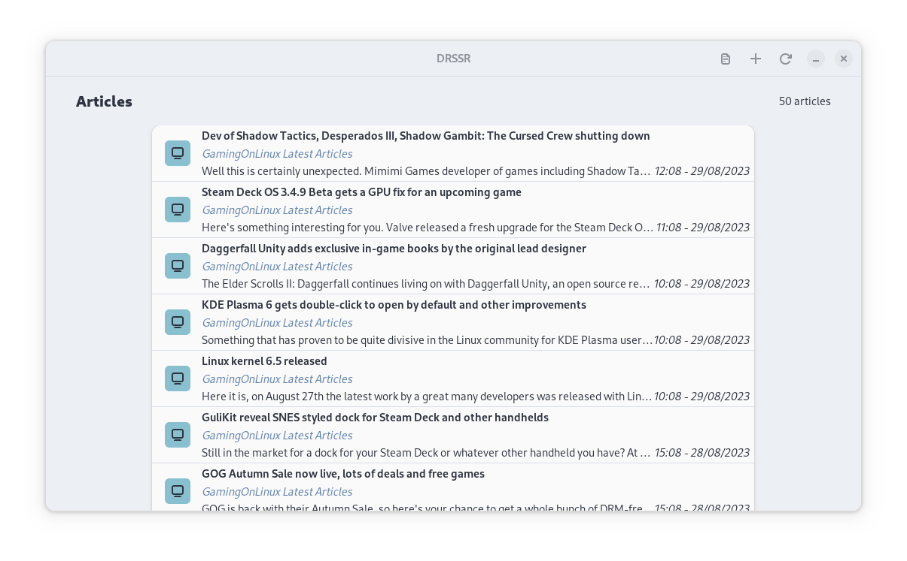
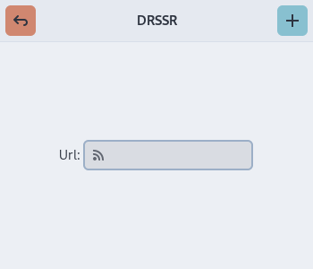
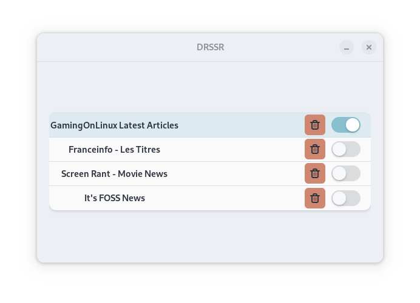

# DSRSSR - Didiloy's RSS Reader
A simple RSS reader written with Python and GTK4.

## Gallery

Homescreen : 

Add a new feed : 

Manage your feeds : 

## Installation
This app only work on Linux, you need to have GTK4 installed on your system.  
Download the  binary file from the [release page](https://github.com/Didiloy/DRSSR/releases).
You can then run the app by double clicking on the file.

If you want to have it recognized by your application launcher there is a desktop file in the "data" directory that you can edit to your liking.
